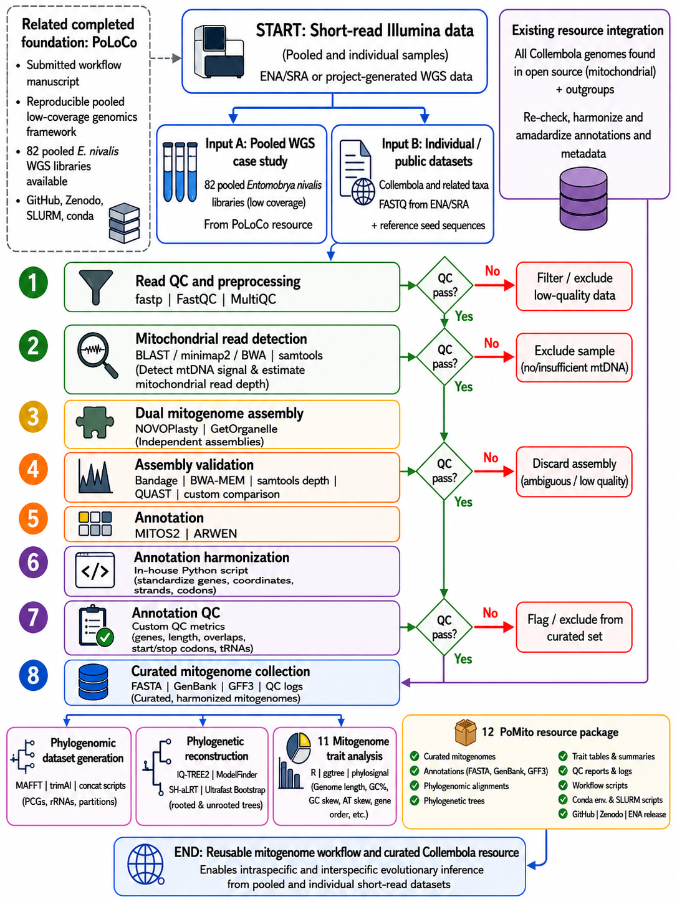

# 🧬 PoMito Workflow

**A reproducible, taxon-aware workflow for mitochondrial genome recovery from pooled or individual low-coverage short-read data and automatic comparative mitogenomic analysis**

<p align="center">
  
</p>

---

## What is PoMito?

PoMito is designed to make mitochondrial information usable from sequencing data that are often generated for other purposes, especially:

- pooled low-coverage whole-genome sequencing,
- long-preserved or low-input non-model invertebrate material,
- individual Illumina WGS libraries,
- public ENA/SRA datasets,
- existing mitochondrial genomes requiring harmonization and comparative analysis.

PoMito is **not restricted to Collembola**. Collembola and the pooled *Entomobrya nivalis* dataset are the first case studies used to validate the workflow.

The workflow keeps the original PoMito idea:

```text
pooled / individual short reads
        ↓
read QC
        ↓
mitochondrial signal detection
        ↓
dual mitogenome assembly
        ↓
assembly validation + pooled-data ambiguity diagnostics
        ↓
annotation
        ↓
annotation harmonization + QC
        ↓
automatic public-resource discovery
        ↓
curated focal + ingroup + outgroup dataset
        ↓
intraspecific and interspecific analyses
        ↓
phylogenomics + mitogenome traits + reproducible report
```

The new design is **local-first**:

- one or a few samples can run on a normal Linux workstation;
- larger batches can run locally with multiple threads;
- SLURM/HPC is optional and only needed when scale makes it useful.

---

## Main scientific contribution

PoMito is not intended to replace NOVOPlasty, GetOrganelle, MITOS2, IQ-TREE2, or downstream tools such as EZmito2.

Its contribution is to connect these components in a reproducible framework that:

1. starts from difficult pooled or individual short-read data;
2. explicitly validates mitochondrial assemblies instead of accepting one assembler output;
3. reports uncertainty caused by pooled mitochondrial haplotypes;
4. automatically constructs the relevant public comparative context around the focal taxon;
5. produces reusable outputs for population-level, phylogenomic, and comparative mitogenome analyses.

---

# Quick start

## 1. Clone the repository

```bash
git clone https://github.com/MohammadJamilShuvo/PoMito-workflow.git
cd PoMito-workflow
```

## 2. Install environments

PoMito uses small modular Conda environments so it can run on a workstation without requiring an HPC.

```bash
bash configs/install_pomito_conda_envs.sh
```

This creates:

```text
pomito_core
pomito_assembly
pomito_phylo
```

MITOS2 is configured separately because local/HPC installations differ.

## 3. Create your project configuration

```bash
cp configs/pomito_user_config.example.sh configs/my_project.sh
```

Edit:

```bash
nano configs/my_project.sh
```

At minimum define:

```bash
SAMPLES_FILE="configs/my_samples.tsv"
FOCAL_TAXON="Your species name"
NCBI_EMAIL="your.email@example.org"
```

For the first development tests, also supply a trusted mitochondrial or COI seed:

```bash
SEED_FASTA="/absolute/path/to/seed.fasta"
```

## 4. Create the sample manifest

Example:

```text
sample_id	read1	read2	input_type	focal_taxon	seed_fasta
sample01	/data/sample01_R1.fastq.gz	/data/sample01_R2.fastq.gz	pooled	Entomobrya nivalis	/data/enivalis_seed.fasta
```

Valid `input_type` values:

```text
pooled
individual
```

## 5. Validate installation and input

```bash
POMITO_CONFIG=configs/my_project.sh \
python -m pomito.cli check
```

## 6. Run locally

Recovery only:

```bash
POMITO_CONFIG=configs/my_project.sh \
python -m pomito.cli run --mode recovery-only --threads 8
```

Full workflow:

```bash
POMITO_CONFIG=configs/my_project.sh \
python -m pomito.cli run --mode full --threads 8
```

Resource construction only:

```bash
POMITO_CONFIG=configs/my_project.sh \
python -m pomito.cli resource
```

---

# Input routes

PoMito is being developed to support four practical entry routes.

### A. Paired pooled WGS

```bash
pomito run --manifest pooled_samples.tsv
```

Primary manuscript use case.

### B. Paired individual WGS

```bash
pomito run --manifest individual_samples.tsv
```

Useful for cross-species validation.

### C. Existing mitogenome FASTA

```bash
pomito resource --taxon "Species name" --query-fasta genome.fasta
```

Skips raw-read assembly and enters at validation/resource construction.

### D. Barcode or trusted seed

```bash
pomito resource --barcode COI.fasta
```

Planned taxonomic-placement mode. In v0.2, barcode-based fully automatic taxon assignment is still experimental and must be reviewed before publication use.

---

# Workflow modules

| Step | Module | Main purpose |
|---|---|---|
| 00 | Input check | validate paths, manifest, config and required commands |
| 01 | Read QC | fastp, FastQC, MultiQC |
| 02 | mtDNA detection | recruit/map reads to trusted mitochondrial context |
| 03 | Dual assembly | NOVOPlasty + GetOrganelle |
| 04 | Assembly validation | mapping, depth, size, ambiguity, assembler comparison |
| 05 | Annotation | MITOS2 + optional ARWEN |
| 06 | Harmonization | standardize gene names, coordinates, strands and formats |
| 07 | Annotation QC | gene recovery, duplication, overlap and consistency checks |
| 08 | Public resource builder | retrieve and filter comparative mitochondrial records |
| 09 | Curated collection | combine new and public resources with provenance |
| 10 | Phylogenomic dataset | extract standardized PCGs/rRNAs |
| 11 | Phylogeny | MAFFT, trimAl, IQ-TREE2 |
| 12 | Mitogenome traits | genome length, GC%, GC/AT skew, structural summaries |
| 13 | Final report | summarize workflow results and software versions |

---

# Dynamic public-resource construction

This is a central PoMito feature.

A user can supply a focal species or taxon, and PoMito builds a reproducible comparative resource by:

1. querying public nucleotide resources;
2. retrieving eligible mitochondrial records;
3. preserving accession and provenance;
4. filtering by configurable sequence length;
5. removing exact duplicate sequences;
6. separating focal/ingroup/outgroup roles;
7. combining public records with newly recovered genomes;
8. generating a manifest documenting every inclusion/exclusion decision.

PoMito does **not** claim to retrieve every sequence on the internet. It retrieves all eligible records returned by the configured database/query rules at the time of analysis.

For publication-grade analyses, automatic outgroup choice must be reviewed. An explicit outgroup can always be provided in the configuration.

---

# Local mode versus HPC mode

## Local mode

Recommended for:

- one sample,
- a few pooled populations,
- public-resource construction,
- annotation/QC,
- phylogenomic analyses of moderate datasets.

Example:

```bash
POMITO_CONFIG=configs/my_project.sh \
python -m pomito.cli run --mode full --threads 8
```

## HPC mode

Recommended for:

- dozens to hundreds of raw WGS libraries,
- all 82 pooled *E. nivalis* populations,
- benchmarking,
- large public datasets.

Example:

```bash
POMITO_CONFIG=configs/pomito_eniv_config.sh \
sbatch hpc/run_pomito_slurm.sh full
```

HPC is an execution option, not a workflow requirement.

---

# First reproducibility benchmark: *Entomobrya nivalis*

PoMito reuses the same ENA study used by PoLoCo:

```text
PRJEB111482
```

Recommended development sequence:

### Test 1: three pooled libraries

1. Import the current PoLoCo ENA manifest:

```bash
bash ena_example/import_poloco_ena_example.sh
```

2. Download or reuse three retained pooled libraries.

3. Convert the PoLoCo manifest into a PoMito manifest:

```bash
python ena_example/prepare_pomito_manifest_from_poloco.py \
  --poloco-manifest ena_example/poloco_ena_case_study_manifest.tsv \
  --reads-root /path/to/downloaded/reads \
  --seed /path/to/enivalis_seed.fasta \
  --max-pools 3 \
  --output ena_example/pomito_test3.tsv
```

4. Copy the case-study config:

```bash
cp configs/pomito_eniv_config.sh configs/pomito_eniv_test.sh
```

5. Edit:

```bash
SAMPLES_FILE="ena_example/pomito_test3.tsv"
SEED_FASTA="/path/to/enivalis_seed.fasta"
NCBI_EMAIL="your.email@example.org"
```

6. Run locally first:

```bash
POMITO_CONFIG=configs/pomito_eniv_test.sh \
python -m pomito.cli run --mode recovery-only --threads 8
```

7. Review outputs before scaling.

### Test 2: 5–10 pools

Repeat with more pools only after assembly and validation behavior are understood.

### Test 3: all 82 retained pools

Run locally only if resources permit; otherwise use SLURM.

---

# What to inspect after the first test

The most important outputs are:

```text
results/02_mtdna_detection/mitochondrial_signal_summary.tsv
results/04_validation/assembly_validation_summary.tsv
results/04_validation/*depth.tsv
results/03_assemblies/<sample>/novoplasty/
results/03_assemblies/<sample>/getorganelle/
```

These first runs will be used to calibrate:

- mitochondrial read-depth thresholds,
- expected mitogenome length,
- assembler concordance,
- coverage-uniformity rules,
- circularity criteria,
- pooled-sample heterogeneity metrics,
- confidence classes.

Final thresholds will be fixed only after benchmark testing.

---

# Assembly confidence

Planned final classes:

```text
HIGH_CONFIDENCE
NEAR_COMPLETE
PARTIAL
AMBIGUOUS
FAILED
```

For pooled libraries, a high-confidence assembly should be interpreted as a **dominant mitochondrial consensus** unless individual haplotypes have been independently resolved.

---

# Expected result structure

```text
results/
├── 01_qc/
├── 02_mtdna_detection/
├── 03_assemblies/
├── 04_validation/
├── 05_annotations/
├── 06_harmonized_annotations/
├── 07_annotation_qc/
├── 08_public_resources/
├── 09_curated_collection/
├── 10_phylogenomics/
├── 11_trees/
├── 12_traits/
└── 13_report/
```

---

# Reproducibility record

After a successful benchmark:

```bash
bash scripts/export_reproducibility.sh
```

This stores:

- Conda environment YAML files,
- explicit package lists,
- PoMito commit SHA,
- configuration used,
- software versions.

---

# Relationship to PoLoCo

**PoLoCo**

```text
pooled LC-WGS
→ draft nuclear reference
→ mapping / filtering
→ Pool-seq allele-frequency matrix
→ population / landscape genomics
```

**PoMito**

```text
same class of pooled/individual short-read data
→ mitochondrial recovery and validation
→ public comparative resource
→ intra- and interspecific mitogenomics
```

PoLoCo repository:

https://github.com/MohammadJamilShuvo/PoLoCo-workflow

---

# Current development limitations

v0.2 deliberately does not hide unfinished areas:

- fully automatic taxonomy inference from an unknown barcode is not yet publication-ready;
- automatic sister/outgroup selection needs taxonomic validation;
- MITOS2 deployment must be configured for the local machine;
- pooled mitochondrial heterogeneity thresholds need empirical calibration;
- dual-assembler comparison will be finalized after the first pooled benchmark;
- the final HTML report is a development module.

---

# Planned manuscript

**Target journal:** *Molecular Ecology Resources*  
**Manuscript type:** workflow and resource paper

---

# Citation

Formal citation will be added after manuscript submission and Zenodo release.

---

# License

MIT License
